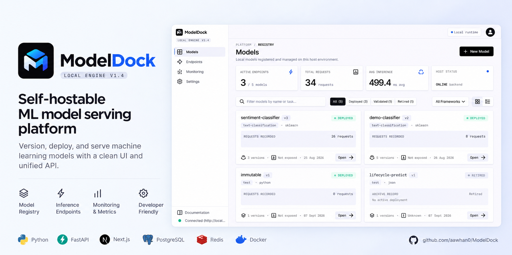
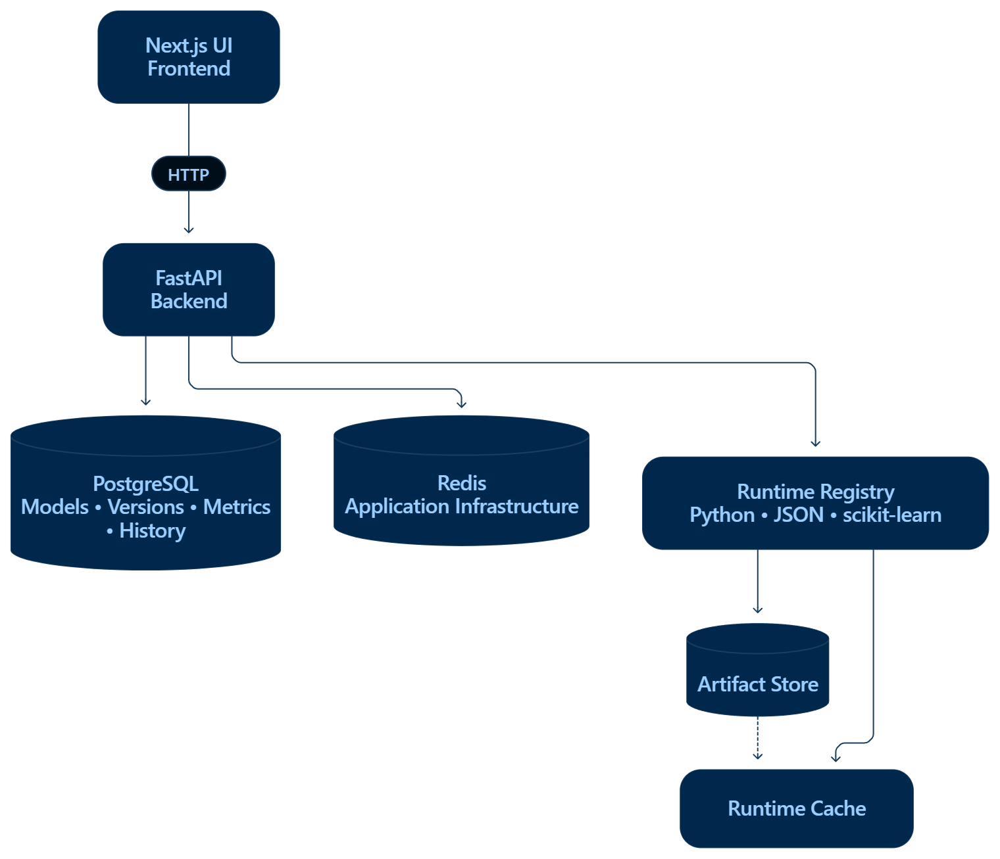
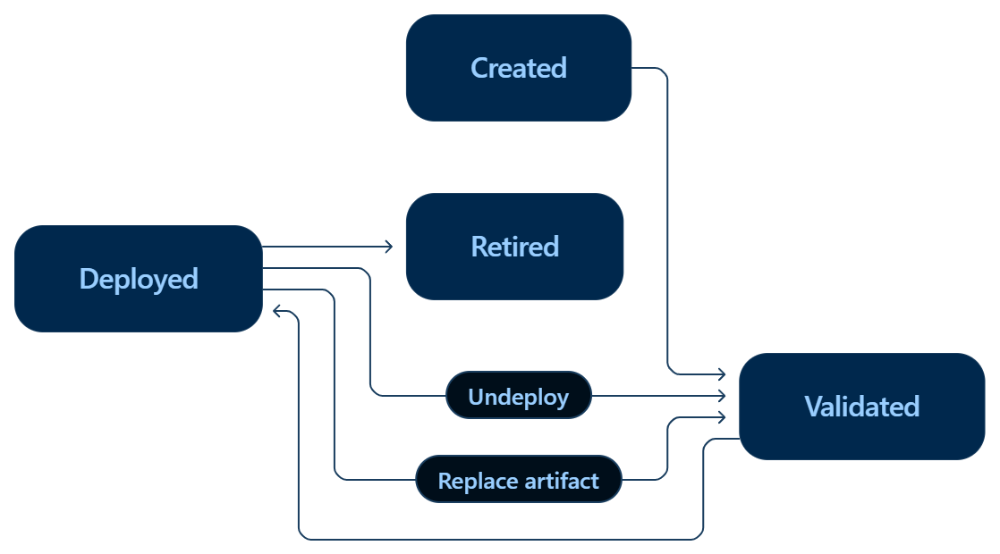
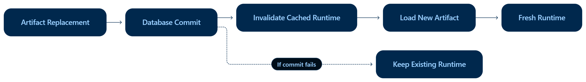

# ModelDock

> **Self-hostable ML model serving platform for model versioning, deployment, inference, benchmarking, and observability.**



ModelDock is a full-stack ML infrastructure project for taking model artifacts from registration to controlled inference. It provides model versioning, artifact validation, pluggable runtimes, deployment lifecycle management, runtime caching, inference history, metrics, authentication, and a web dashboard.

## Highlights

- **Model registry** with versioned model management
- **Artifact management** with upload, replacement, validation, size limits, and filename normalization
- **Multiple runtimes** for Python, JSON, and scikit-learn artifacts
- **Explicit deployment lifecycle** with deploy, undeploy, and retirement behavior
- **Inference API** with version-aware prediction requests
- **Runtime caching** with safe artifact replacement invalidation
- **Restricted Python execution** with import, dunder, and unsafe builtin checks
- **Authentication** with configurable API key protection
- **Metrics and inference history** for operational visibility
- **Dockerized development** with PostgreSQL and Redis
- **Next.js dashboard** for models, inference, history, and monitoring
- **Automated CI** for backend tests, compilation, and frontend builds

## Architecture



## Model Lifecycle



Key rules:

1. Uploading or replacing an artifact returns the version to a validated state.
2. A version must be deployed before it can receive inference traffic.
3. Deploying a new version retires the previously deployed version for that model.
4. Replacing an artifact invalidates its cached runtime after the database change commits.
5. Undeployed versions reject prediction requests.

## Runtime System

ModelDock uses a runtime registry and a common runtime contract so the API does not depend on individual model formats.

### Python

Python artifacts expose a callable named `model`.

Before execution, the runtime applies a restricted policy that includes:

- Import blocking
- Dunder name and attribute blocking
- Unsafe builtin blocking
- Restricted builtin namespace
- Source validation before execution

This is an intentionally restricted execution layer, not a complete sandbox for hostile arbitrary Python.

### JSON

Supports deterministic JSON-based prediction mappings.

```json
{
  "predictions": {
    "hello": "positive",
    "goodbye": "negative"
  }
}
```

### scikit-learn

Loads serialized scikit-learn-compatible models and validates the expected prediction interface.

## Runtime Caching

Loaded runtime instances are cached to avoid repeatedly loading the same artifact.

When an artifact changes:



Cache invalidation is tied to the persistence flow so a failed artifact replacement does not leave cache state inconsistent.

## Security and Artifact Handling

ModelDock treats uploaded artifacts as untrusted application input.

Controls include:

- API key authentication
- Configurable CORS origins
- Artifact path and file validation
- Configurable maximum artifact size
- Filename normalization
- Runtime-specific validation
- Restricted Python source checks
- Explicit deployment state
- Redis-backed API rate limiting with configurable limits and fail-open behavior
- Security response headers for browser-facing clients

API rate limiting is enabled by default for `/api/v1` routes. The default limit is 60 requests per client per 60-second window. Health, readiness, and Prometheus metrics endpoints are excluded so operational checks are not blocked.

Rate limiting uses Redis as shared state across backend instances. If Redis becomes temporarily unavailable, ModelDock fails open by default so a Redis outage does not take down the API. Set `MODELDOCK_RATE_LIMIT_FAIL_OPEN=false` when availability of the rate limiter should take precedence over API availability.

For non-local environments, keep authentication enabled and store secrets outside source control.

## Experiment Lineage

ModelDock now tracks the path from training data and run metadata to a registered model version.

The experiment layer provides:

- Versioned dataset records with optional source URIs and descriptions
- Experiments with explicit lifecycle status
- Training-run records with hyperparameters and evaluation metrics
- Optional links from a run to a ModelDock model version and dataset
- A model-version lineage endpoint that groups the experiments and runs that produced a version

The core endpoints are:

```text
POST  /api/v1/datasets
GET   /api/v1/datasets
POST  /api/v1/experiments
GET   /api/v1/experiments
PATCH /api/v1/experiments/{experimentId}
POST  /api/v1/experiments/{experimentId}/runs
GET   /api/v1/experiments/{experimentId}/runs
PATCH /api/v1/runs/{runId}
GET   /api/v1/experiments/lineage/model-versions/{modelId}/{version}
```

This is metadata and lineage infrastructure rather than a training engine: external training jobs can record their inputs, parameters, metrics, and resulting ModelDock version without forcing ModelDock to own the training stack.

## Inference and Observability

Inference requests record operational data including:

- Model and version identity
- Prediction success or failure
- Inference latency
- Inference history

The dashboard exposes model-specific inference, history, and monitoring views.

## API

The backend provides endpoints for:

- Model and version registration
- Model metadata editing (rename, task, description)
- Artifact upload and replacement
- Deployment and undeployment
- Prediction
- Health checks
- Metrics, including data drift monitoring per deployed version
- Inference history
- API key management

Prediction requests use:

```text
/api/v1/models/{modelId}/versions/{version}/predict
```

Model metadata updates use:

```text
PATCH /api/v1/models/{modelId}
```

Data drift for a deployed version, comparing recent inference inputs against an early baseline (PSI-based):

```text
GET /api/v1/metrics/{modelId}/{version}/drift
```

A Prometheus-compatible metrics endpoint is also available at `/metrics` for scraping (unauthenticated, like `/health`).

The FastAPI application also provides interactive OpenAPI documentation.

Frontend routes include:

```text
/models/{modelId}
/inference/{modelId}/{version}
/history/{modelId}/{version}
/monitoring/{modelId}/{version}
```

## Run Locally

### Requirements

- Docker
- Docker Compose
- Git

### Setup

```powershell
git clone https://github.com/aawhan0/ModelDock.git
cd ModelDock
Copy-Item .env.example .env
docker compose up -d
docker compose exec backend alembic upgrade head
docker compose ps
```

Configure the environment values in `.env` before using the application outside local development.

## Verification

### Backend

```powershell
docker compose exec backend pytest -q
docker compose exec backend python -m compileall -q app
```

### Frontend

```powershell
docker compose exec frontend npm run typecheck
docker compose exec frontend npm run build
```

Current verified baseline:

| Check | Result |
| --- | --- |
| Backend tests | 72 passed |
| Backend compile | Passed |
| Frontend typecheck | Passed |
| Frontend production build | Passed |

## CI/CD

GitHub Actions validates every pull request and every change merged to `main`.

CI covers:

- Repository hygiene, workflow validation, and Dockerfile linting
- Backend dependency checks, migrations, compilation, tests, and coverage
- Frontend dependency audit, type checking, and production build
- Development Docker smoke tests and production-image builds
- Dependency Review, secret scanning, and CodeQL

Tagged releases use:

```text
.github/workflows/release.yml
```

A release tag such as `v0.6.0` automatically:

1. Validates the production backend and frontend images.
2. Publishes versioned container images to GitHub Container Registry.
3. Publishes an image tag tied to the source commit for reproducibility.
4. Creates a GitHub Release with generated release notes.

Before publishing a release, configure the repository variable `MODELDOCK_PUBLIC_API_URL`. This value is baked into the Next.js frontend image at build time.

Published images:

```text
ghcr.io/aawhan0/modeldock/backend:<version>
ghcr.io/aawhan0/modeldock/frontend:<version>
```

The release workflow publishes artifacts; deployment to a specific hosting provider is intentionally kept separate so ModelDock can remain self-hostable.

## Project Structure

```text
ModelDock/
├── .github/workflows/ci.yml
├── backend/
│   ├── alembic/
│   ├── app/
│   │   ├── api/
│   │   ├── core/
│   │   ├── models/
│   │   ├── schemas/
│   │   └── services/runtimes/
│   └── tests/
├── frontend/
├── docs/
│   └── diagrams/
│       ├── architecture.png
│       ├── model-lifecycle.png
│       ├── runtime-cache.png
│       └── ci-pipeline.png
├── docker-compose.yml
├── .env.example
└── README.md
```

## Tech Stack

| Layer | Technologies |
| --- | --- |
| Backend | Python, FastAPI, SQLAlchemy, Alembic, Pydantic, Pytest |
| Frontend | Next.js, React, TypeScript |
| Infrastructure | Docker, Docker Compose, PostgreSQL, Redis |
| ML runtimes | Python, JSON, scikit-learn, Joblib |
| CI | GitHub Actions |

## Engineering Focus

ModelDock is built around a few practical infrastructure principles:

- **Explicit state:** registration, validation, deployment, and retirement are separate concerns.
- **Runtime abstraction:** model loading is isolated from API logic.
- **Cache correctness:** artifact changes invalidate affected runtime state safely.
- **Persistent telemetry:** inference behavior is stored instead of kept only in memory.
- **Defensive artifact handling:** uploaded model files are validated before execution.
- **Automated verification:** backend and frontend checks run locally and in CI.

## Contributing

ModelDock is open to contributions from developers, students, and ML practitioners.

New to the project? Start with the [New contributors start here](https://github.com/aawhan0/ModelDock/issues/12) guide, then pick an open [good first issue](https://github.com/aawhan0/ModelDock/issues?q=is%3Aissue%20state%3Aopen%20label%3A%22good%20first%20issue%22).

Before opening a pull request, please read [CONTRIBUTING.md](CONTRIBUTING.md). The repository runs automated backend and frontend checks on pull requests.

## Author

### Aawhan Vyas

AI engineering, backend systems, full-stack development, and practical ML infrastructure.

- **LinkedIn:** [Aawhan Vyas](https://www.linkedin.com/in/aawhanvyas/)
- **GitHub:** [aawhan0](https://github.com/aawhan0)
